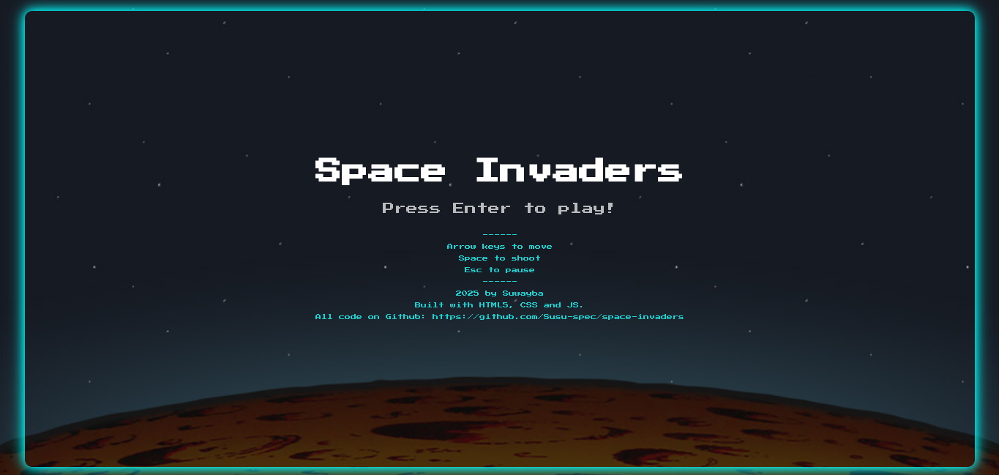
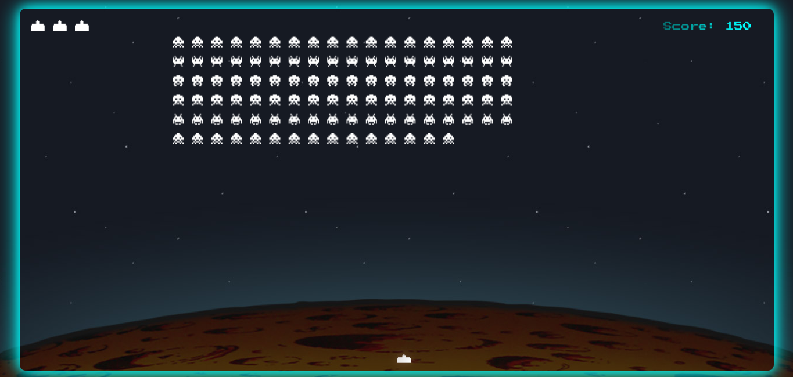

# Space Invaders
Space invaders is an interactive web-based game built with HTML, CSS and JavaScript.  It’s a single-player arcade-style game where the player controls a spaceship that moves horizontally between boundaries to shoot at descending alien invaders. The goal is to eliminate the aliens before they reach the bottom of the screen.

A re-imagining of the original 1978 arcade game of the same name by Tomohiro Nishikado released by the Taito corporation.

## Game Features

- Five difficulty levels with increase in speed rate of aliens spacing between aliens
- Score tracking
- Sound effects and background music

## How to Play

- Navigate rocket ship movement
- Avoid getting hit by aliens, each hit is a life and you've only got three of those
- Shoot at aliens to gain points
- As you shoot upwards, aliens higher than others on the board grant more points
- Progress through increasingly difficult levels

## Controls
- On desktop, use keyboard to access gameplay
- Press Arrow left and right to control player movements
- Press space bar to shoot bullets at aliens
- Press Esc to pause game play

## Technical Implementation

### Architecture

The game uses a modular component-based architecture inspired by some entity-component structure. 

- `main.mjs`: Core game logic, rendering and input response.
- `game-entity.mjs`: Defines Movable game objects.
- `assets.mjs`: Loads and organizes game assets (image, sounds, fonts).
- `helpers.mjs`: Utility functions
- `levels.mjs`: Level definition and configuration.
- `bullets.mjs`: Bullet and Laser definitions.
- `particles.mjs`: Particle definitions.
- `constants.mjs`: Constant definitions used across files.
- `alien.mjs`: Alien class definitions.
- `player.mjs`: Player class definition.

### Key Technical Features
- Canvas based rendering
- Axis-Aligned Bounding Box Algorithm to detect collisions
- Particle effects for alien explosions
- Custom zooming effect on level transitions
- Score-based level progression
- Sound integration

## Code Structure
├── assets/
│ └── images/ # Game object and background images (e.g., player, aliens...)
│ └── raster-forge-font/ # Custom font assets 
│ └── sounds/
├── index.html # Game entry point
├── css/
│ └── main.css # Core styles
├── js/
│ ├── main.mjs # Game loop, input handling, rendering
│ ├── game-entity.mjs # Classes for movable objects
│ ├── assets.mjs # Organizes sounds, images, fonts
│ ├── helpers.mjs # Utility functions (e.g., collision detection, randomizers...)
│ ├── levels.mjs # Level configs: speed, spacing
│ ├── bullets.mjs # Bullet and laser logic (player & alien)
│ ├── particles.mjs # Particle system for explosions
│ ├── constants.mjs # Shared constants: canvas size, key mappings
│ ├── alien.mjs # Alien grid system and enemy logic
│ └── player.mjs # Player class, movement, and shooting